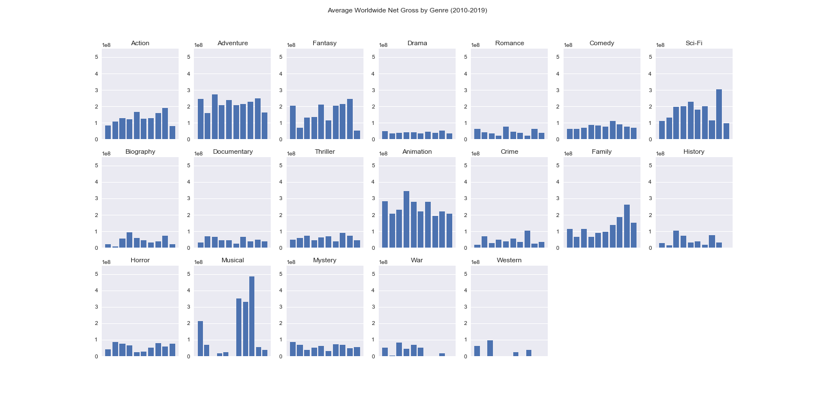
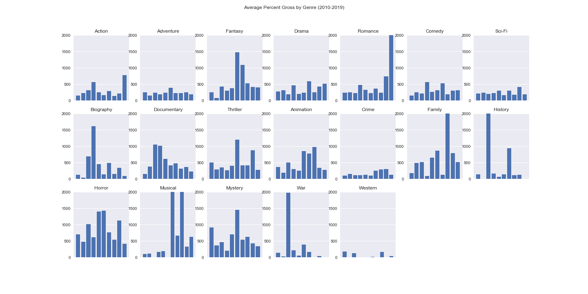
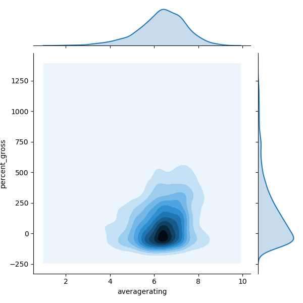
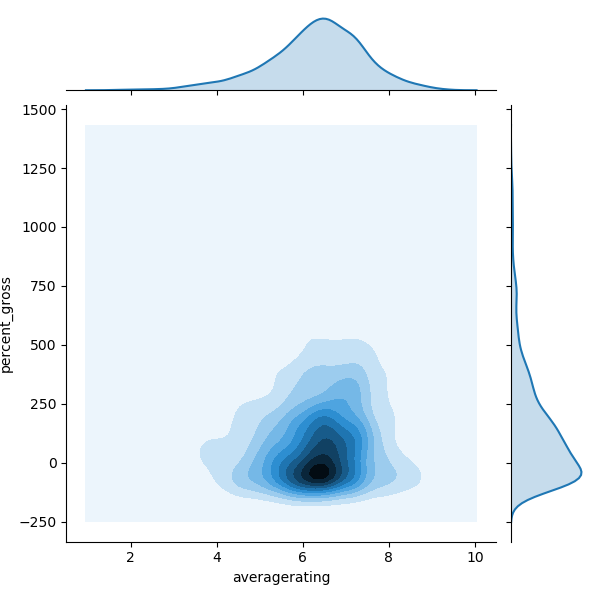
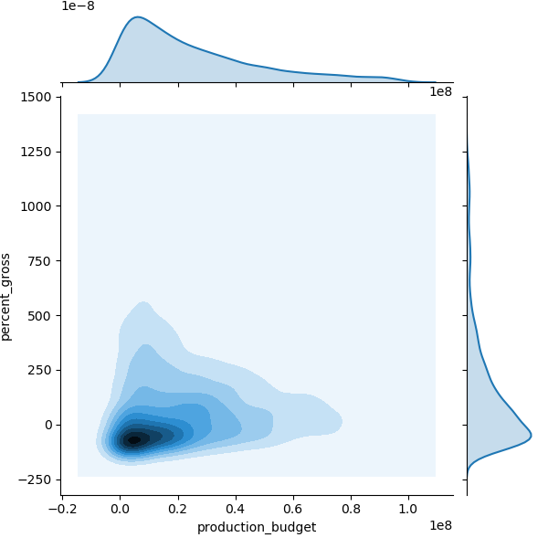

# Microsoft Studios: Film Production Strategy

**Authors**: Jacob Heyman, Mitch Krieger

## Overview

Using data from IMDB, we investigated trends in films the past 10 years in order to best reccomend to Microsoft what strategies to employ to launch their new video and content creation division. We analyized various metrics of a film's success including, gross revenues, net profit and return on investment (percentage gross) against a variety of factors such as genre, rating, runtime, and production budget. Our findings indicate that Microsoft should focus on producing new films with conservative budgets with an emphasis on certain genres. In addition, Microsoft should not be concerned with high-profile principle cast and crew, nor should they be overly concerned with runtime, performance internationally or movie-goer reviews as our data suggests that these factors are not correlated with a film's financial success. 

## Business Problem

In order to stay competitive with existing tech companies like Apple and Amazon, Microsoft wishes to start their own video content creation studio. To best launch their new venture, Microsoft hopes to look at trends in movie data in order to focus on producing the most competitive content. From these trends, Microsoft is seeking actionable insights to spearhead the opening of their movie studio and produce data-driven projects. A challenege for Microsoft will be differentiating themselves in the crowded field of content creation, and determining what factors most affect a film's success.

**Research Questions to Consider:**
To provide the best insights for Microsoft's new studio, we focused on movie data from the past 10 years using profit and percentage gross as metrics of success and what factors affect that success. With this in mind we developed the following question to investigate:

1. Which genre of movies has the highest average net **profit** over the past 10 years?
2. Which genre of movies has the greatest percentage return on investment (percentage gross)?
3. What is the relationsship between box office gross/ROI (percentage gross) and the following factors?
   - IMDB Rating
   - Runtime
   - Budget
4. Does director/writer/acting choices affect the profitiability of a movie? 
5. What is the relationship between domestic gross and foreign gross?

## Data

To answer the above questions, we collected various datasets from IMDB and the Box Office. Then, we created a new set of data to analyze the relevant factors that affect our metrics of success and our research questions. The following are the sources of data we used:

Data Sets:
* imdb_title_df - **IMDB Movie titles & genre** - tconst, primary_title, original_title, start_year, runtime_minutes, genres
* imdb_name_df - **IMDB Staff Names & Jobs** - nconst, primary_name, birth_year, death_year, primary_profession, known_for_titles (tconst)
* imdb_title_crew_df - **IMDB Movie Directors & Writers** - tconst, directors(nmconst), writers (nmconst)
* imdb_principles_df - **IMDB Movie Principle Roles & Crew)** - tconst, ordering, nconst, category, job, character
* imdb_title_rating_df - **IMDB Ratings** - tconst, avgeragerating, numvotes
* movie_budgets_df - **Box Office Grosses & Budgets** - id, movie, release_date, production_budget, domestic_gross, worldwide_gross

From these datasets we eliminated any irrelevant data and then found the worldwide net profit and return on investment (percentage gross) as our main metrics of success. We then decided to focus how on these facors affect those metrics in our analysis: year, runtime_minutes, genre, production_budget, principle_crew (nmconst), averagerating.

## Methods

This project uses a graphical and descriptive approach to analysis of the data. Based on the needs of the research questions, isolated factors were used to create various graphs (scatter, bar, line, kernel density estimates) to provide visualization to data trends. From these trends we can generate insights for Microsoft studio's trajectory.

## Results

Our findings concerning the effects of genre on net worldwide profit reveal that specific genres have higher financial returns, although others have a better percentage gross return.




Our analysis of principle crew, rating and runtime suggests that there is no direct correlation on ROI. Despite the there being no direct correlation, highly successful movies tend to fall near the average of these factors shown by kernel density estimates.

KDE Runtime vs Percent Gross | KDE IMDB Rating vs Percent Gross
:-: | :-: 
 | 

KDE Actor Average Movie Rating vs Percent Gross | KDE WritersAverage Movie Rating vs Percent Gross |KDE Directors Average Movie Rating vs Percent Gross
:-: | :-: | :-:
 | ||

In two separate analyses, production budget was found to have a significant impact on ROI. Lower buget films have a much higher likelihood of a high ROI but high budget films more consitently have a positive return.

Budget vs Percent Gross by year|KDE Production Budget vs Percent Gross
:-: | :-: 
 | 

## Conclusions

Our analysis leads us to suggest the following strategies to Microsoft:

- **Focus on a select few genres:** By focusing their efforts on a few genres with high potential grosses and/or ROI, Microsoft can build a competitive portfolio of films. The results of our analysis demonstrate that the following genres may yeild high successs: 

    - High Gross: Action, Adventure, Animation, Fantasy, Sci-Fi, Musical
    - High ROI: Horror, Mystery, Thriller, Documentary, Animation

- **Diversify Production Budgets:** Because high budget films more consistenly have net positive returns but are expensive and lower budger films have a higher return but a higher rate of failue, we suggest have a mixed portfolio of high and low budget films. Although there are outliers with high ROIs in extremely low budget films (less than $500,000), based off our findings we reccomend the setting lower budget portion of the portfolio between $500,000 to $5 million, and the higher buget portion at $5 to $20 million.
  
- **Movie Budget Spending:** There is little to no correlation between the factors average rating, princple crew/cast, and runtime, but there is a strong correlation between budget and success of a film. With this in mind, we can infer that the use of the budget can be used on other facets of movie production and studio operation without concern of major impact on success. Similarly, because there is a strong correlation between success domestically and in the foreign market, Microsoft can produce domestically successful movies without concern about their success abroad. 

## Next Steps

Many of the factors from our analysis drew a null conclusion. In a further investigation we would suggest looking at new factors such as, MPAA rating, awards, release time, etc to gauge other potential predictors of movie success. In addition, it would be beneficial to look at other factors of success that add to total profit such as streaming revenues, DVD sales, merchandising, advertising and so on, especially considering whether the distribution of Microsoft's movies will be in theaters or online via streaming. 

## For More Information

Please review our full analysis in [our Jupyter Notebook](./dsc-phase1-project-template.ipynb) (XXX UPDATE NOTEBOOOK XXX) or our [presentation](./DS_Project_Presentation.pdf). (XXX CREATE PRESENTATION XXXX)

For any additional questions, please contact **Mitch Krieger (mitkrieger@gmail.com), Jacob Heyman (jacobheyman702@gmail.com)**

## Repository Structure (XXXX UPDATE REPOSITORY XXXX)

Describe the structure of your repository and its contents, for example:

```
├── __init__.py                         <- .py file that signals to python these folders contain packages
├── README.md                           <- The top-level README for reviewers of this project
├── dsc-phase1-project-template.ipynb   <- Narrative documentation of analysis in Jupyter notebook
├── DS_Project_Presentation.pdf         <- PDF version of project presentation
├── code
│   ├── __init__.py                     <- .py file that signals to python these folders contain packages
│   ├── visualizations.py               <- .py script to create finalized versions of visuals for project
│   ├── data_preparation.py             <- .py script used to pre-process and clean data
│   └── eda_notebook.ipynb              <- Notebook containing data exploration
├── data                                <- Both sourced externally and generated from code
└── images                              <- Both sourced externally and generated from code
```
